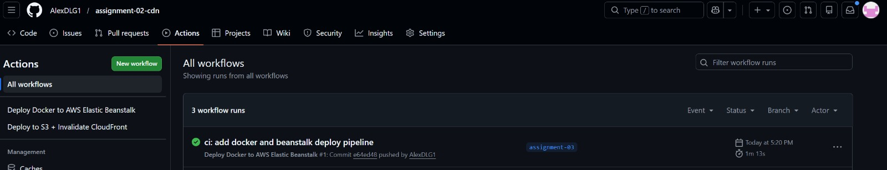
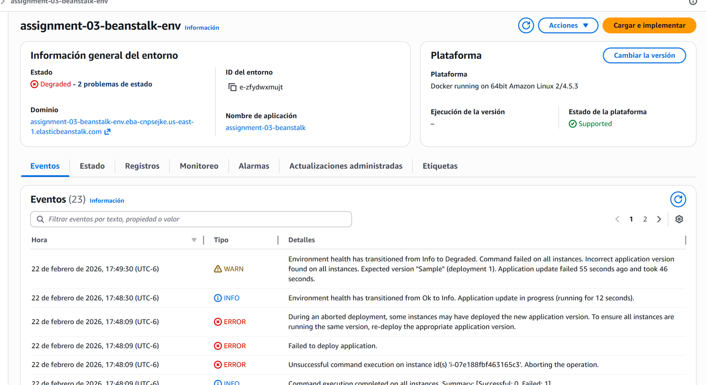
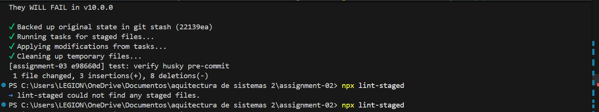
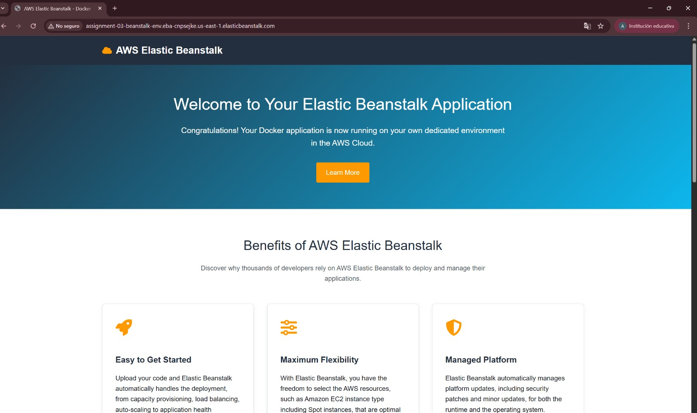

# Assignment 03 — Deploy con Docker + Elastic Beanstalk (AWS)

## Descripción
En esta tarea se creó una aplicación web sencilla con **Vite + React + TypeScript**, se dockerizó y se configuró un **pipeline en GitHub Actions** para desplegarla en **AWS Elastic Beanstalk** usando **Amazon ECR**.

---

## Tecnologías usadas
- Vite
- React
- TypeScript
- Docker
- GitHub Actions
- AWS Elastic Beanstalk
- Amazon ECR
- Husky + lint-staged

---

## Objetivo de la tarea
- Crear una app web estática sencilla
- Configurar **Dockerfile**
- Configurar **Husky** para validaciones antes del commit
- Crear pipeline de **GitHub Actions**
- Subir imagen Docker a **Amazon ECR**
- Desplegar en **Elastic Beanstalk**

---

## Archivos importantes
- `Dockerfile`
- `.github/workflows/deploy-beanstalk.yml`
- `.husky/pre-commit`

---

## Evidencias

### 1) Pipeline exitoso en GitHub Actions

### 2) Entorno en Elastic Beanstalk

### 3) Prueba de Husky / lint-staged

### 4) Aplicación corriendo

---

## Nota
El despliegue se configuró en la rama **`assignment-03`** y se reutilizó el repositorio de la tarea anterior, agregando la configuración nueva para Docker + Beanstalk.

---

## Autor
Alexander Emiliano
