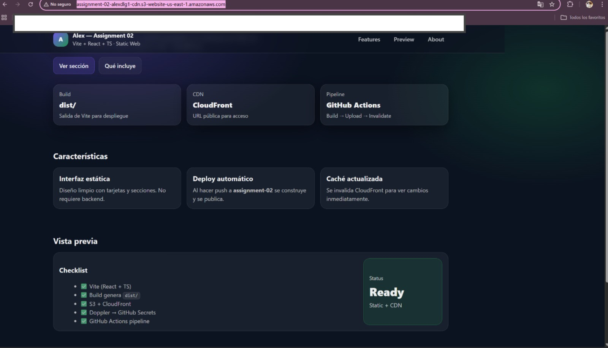
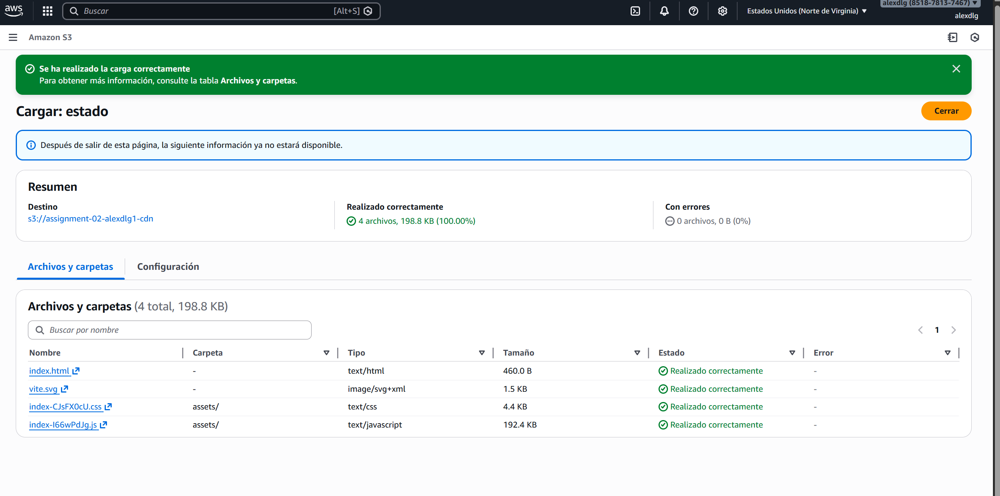
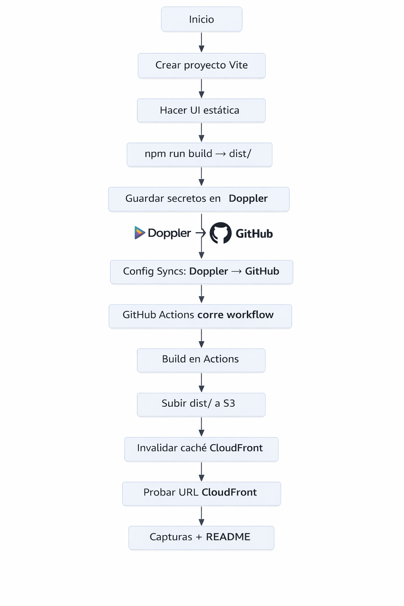

# Assignment 02 — Static Web + CDN (AWS)

Aplicación web estática creada con **Vite + React + TypeScript**, desplegada en **AWS S3** y distribuida públicamente por **CloudFront**.  
El objetivo es que cualquier persona pueda acceder a la app mediante una URL pública del CDN y que el repositorio muestre evidencia del flujo de trabajo (secrets + pipeline + commits).

---

## 1) Proyecto (Vite)

- Framework: Vite + React + TypeScript
- Resultado del build: se genera la carpeta `dist/` para despliegue
- Interfaz: aplicación estática

---

## 2) URL pública del CDN (CloudFront)

**URL pública:** `http://assignment-02-alexdlg1-cdn.s3-website-us-east-1.amazonaws.com/`

> Nota: La aplicación se puede abrir desde cualquier navegador en modo incógnito.

---

## 3) Doppler (secrets)

Se configuró un proyecto en Doppler para manejar credenciales necesarias de despliegue (valores ocultos por seguridad).  
La integración con GitHub se realizó mediante Sync.

**Evidencias:**
- Config Syncs (Doppler → GitHub)
- Variables/Secrets en Doppler (valores ocultos)

📌 Todas las imágenes de evidencia se encuentran en la carpeta `docs/`.

---

## 4) GitHub Secrets

Se verificó la sección de Secrets en GitHub para el repositorio.  
(En las capturas no se muestran valores, solo nombres).

📌 Todas las imágenes de evidencia se encuentran en la carpeta `docs/`.

---

## 5) Pipeline (GitHub Actions)

Se configuró un workflow en `.github/workflows/` con las etapas:

- **Build:** instala dependencias y genera `dist/`
- **Upload:** sube `dist/` al bucket de S3
- **Invalidate:** invalida caché en CloudFront para reflejar cambios

📌 Todas las imágenes de evidencia se encuentran en la carpeta `docs/`.

---

## 6) Evidencia de commits (desarrollo incremental)

La rama de entrega es: **`assignment-02`** (creada a partir de `main`).  
Se realizaron múltiples commits para reflejar el avance incremental del proyecto.

📌 Todas las imágenes de evidencia se encuentran en la carpeta `docs/`.

---

## 7) Captura de la aplicación

Se incluye evidencia visual de la aplicación desplegada y funcionando correctamente.

📌 Todas las imágenes de evidencia se encuentran en la carpeta `docs/`.

---

## 8) Diagrama de flujo del CI/CD

Se incluye un diagrama simple del flujo del pipeline para el despliegue automático.

📌 Todas las imágenes de evidencia se encuentran en la carpeta `docs/`.

---

## 9) Capturas y diagramas (docs)

### Captura de evidencia 1

### Captura de evidencia 2

### Diagrama de flujo CI/CD

