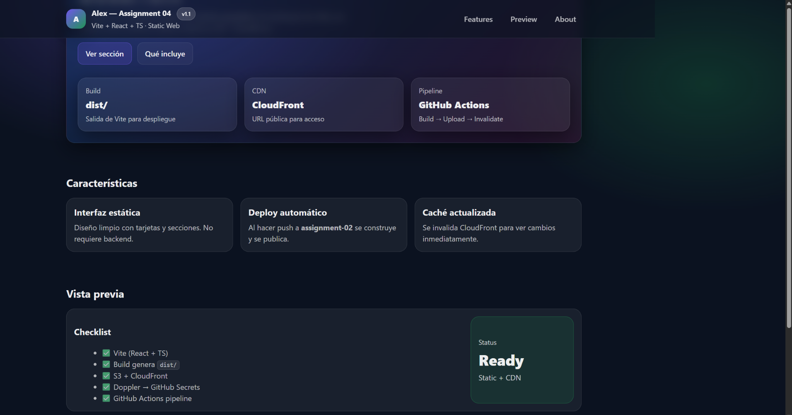
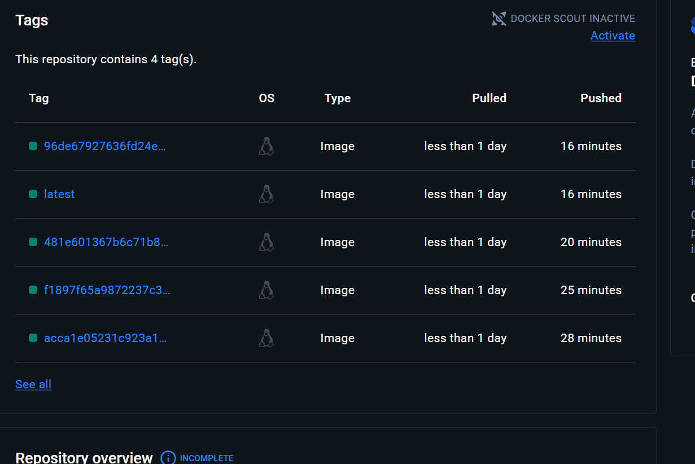

# Assignment 04 — Docker Hub + GitHub Actions
> Evidencias de Docker Hub y pipeline CI/CD.

Aplicación web estática creada con **Vite + React + TypeScript**, dockerizada con **Nginx** y publicada automáticamente en **Docker Hub** usando **GitHub Actions**.

En cada commit a la rama `assignment-04` el pipeline construye la imagen y la sube con dos tags:
- `latest`
- `SHA del commit`

---

## Captura de la aplicación


---

## URL de la imagen del Docker Hub
https://hub.docker.com/r/alexdlg1/assignment-04

---

## Captura de pantalla con imágenes y tags en Docker Hub


---

## Pipeline (GitHub Actions)
El workflow ejecuta:
1. Checkout del repositorio.
2. Login a Docker Hub usando secrets.
3. Build de la imagen Docker.
4. Push a Docker Hub con:
   - `alexdlg1/assignment-04:latest`
   - `alexdlg1/assignment-04:${GITHUB_SHA}`

---

## Problemas encontrados y solución
- **Dockerfile no encontrado en el pipeline** (`open Dockerfile: no such file or directory`):  
  Se solucionó creando el `Dockerfile` en la raíz del proyecto y subiéndolo al repositorio.

- **Error de autenticación con Docker Hub** (credenciales requeridas / 401 Unauthorized):  
  Se solucionó configurando `DOCKERHUB_USERNAME` y `DOCKERHUB_TOKEN` en GitHub Actions usando un **Access Token** con permisos de escritura.

- **Puerto ocupado al ejecutar localmente** (`bind: Only one usage of each socket address...`):  
  Se solucionó usando otro puerto, por ejemplo `-p 8081:80`.

---

## Ejecución local
```bash
docker build -t assignment-04-local .
docker run --rm -p 8081:80 assignment-04-local
